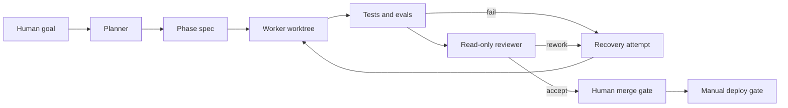

# AI Agent Site Harness

개발 비전공자가 AI coding agent를 어디까지 신뢰할 수 있는지 확인하기 위해 만든 실행·검증 저장소입니다. 결과물인 인터랙티브 칼럼과 AWS 인프라의 Git 이력을 보존하고, 이후 작업을 phase 명세, 격리된 worktree, 자동 검증, 읽기 전용 리뷰, 실패 복구로 운영합니다.

이 저장소의 포트폴리오 대상은 웹페이지 한 장이 아니라 그 웹페이지를 만들고 확인하는 작업 구조입니다.

## What this repository proves

| Claim | Inspectable evidence |
| --- | --- |
| 사이트를 단계적으로 구현하고 수정했다 | `frontend/`의 원본 커밋 `166b6b1`부터 `873ae0c`까지의 연결된 이력 |
| 실행 가능한 검증을 추가했다 | `e1fa9e1`, 현재 frontend 테스트, harness 테스트 |
| 실패한 개편을 복구했다 | `26489b6`과 이를 되돌린 `40b571b` |
| 권한 경계를 설명하는 인터랙션을 구현했다 | `49f749b`와 `frontend/app/article-interactions.tsx` |
| private S3와 CloudFront OAC를 코드로 구성했다 | `infra/terraform/`, `140b6b0`, Terraform security contract |
| 실제 도메인 경로를 검증했다 | `infra/docs/deployment-proof.md`, `0321abc` |
| harness 도입 후 작업을 격리한다 | `codex/phase-00-harness-bootstrap`, phase 파일, worktree 테스트 |

`git log --graph --all`을 실행하면 프론트엔드와 인프라의 원본 커밋이 각각 harness import commit의 부모로 나타납니다. 파일만 복사한 저장소와 달리 어떤 변경이 언제 추가되고 되돌려졌는지 추적할 수 있습니다.

## Harness flow



The worker invocation uses `codex exec --json --sandbox workspace-write`. The reviewer uses the same non-interactive interface with a `read-only` sandbox. Both receive the phase Markdown through standard input. Neither role may merge or deploy.

The command shape follows the official [Codex non-interactive mode](https://learn.chatgpt.com/docs/non-interactive-mode). Worktree isolation follows the [Codex worktree guidance](https://learn.chatgpt.com/docs/environments/git-worktrees), and repository rules use the documented [AGENTS.md instruction hierarchy](https://learn.chatgpt.com/docs/agent-configuration/agents-md).

## Repository map

```text
.
├─ .github/workflows/       deterministic CI and a manual production gate
├─ backend/                 truthful production-backend status
├─ docs/
│  ├─ adr/                  design decisions
│  ├─ architecture/         harness and AWS boundaries
│  ├─ orchestration/        roles, states, and evidence rules
│  ├─ phases/               executable Markdown work contracts
│  └─ runbooks/             start, verify, recover, and deploy procedures
├─ frontend/                imported interactive article and its history
├─ infra/terraform/         imported CloudFront, OAC, and private S3 code
├─ tests/                   harness contract and integration tests
└─ tools/orchestration/     phase, worktree, Codex, verification, and metrics tools
```

## Run the checks

Requirements:

- Node.js 22.13 or newer
- Terraform 1.11 or newer; CI uses 1.15.8
- Git
- Codex CLI only when starting a model run

Install and verify the harness:

```powershell
npm ci
npm run verify:harness
```

Verify the imported frontend:

```powershell
npm run verify:frontend
```

Verify the infrastructure without creating AWS resources:

```powershell
terraform -chdir=infra/terraform fmt -check -recursive
terraform -chdir=infra/terraform init -backend=false -input=false
terraform -chdir=infra/terraform validate
terraform -chdir=infra/terraform test
```

## Run a phase

Validate phase contracts and create the declared worktree:

```powershell
npm run validate:phases
node tools/orchestration/new-phase.mjs docs/phases/phase-01-baseline-measurement.md
```

Inspect the Codex command and prompt before starting it:

```powershell
node tools/orchestration/run-phase.mjs docs/phases/phase-01-baseline-measurement.md --dry-run
```

Run deterministic checks and keep raw evidence outside Git:

```powershell
node tools/orchestration/verify-phase.mjs docs/phases/phase-01-baseline-measurement.md `
  --output .harness/runs/raw/phase-01-verification.json
```

See `docs/runbooks/` for the review, recovery, and deployment gates.

## Metrics

Each completed phase can report:

- first-pass acceptance
- recovery attempts
- human interventions
- final test totals
- time from phase start to approval

Phase 01 and phase 02 reserve a bounded comparison between a single-session task and the harness workflow. One comparison will remain a case study; the README will not turn it into a general productivity statistic.

The bootstrap run is recorded in `docs/orchestration/runs/phase-00/`. It reports one contained repository-path recovery followed by 35 passing checks across the harness, frontend, and Terraform contracts.

## Deployment boundary

The production path is:

```text
Browser → CloudFront → OAC-signed request → private S3 origin
```

Pull request workflows never deploy. `deploy-manual.yml` requires a manual boolean input, the protected `production` environment, and short-lived AWS credentials through GitHub OIDC. The workflow builds and tests before it uploads static files. It does not run `terraform apply`.

## Limitations

- The original frontend repository exposes only `main` in the imported Git data. Earlier worktree or subagent use cannot be proven from that history, so this repository makes no retrospective claim about it.
- The site has no production application backend. Worker, D1, and Drizzle files in `frontend/` are imported scaffold, not deployed-backend evidence.
- Raw Codex JSONL may contain private context and stays ignored. Only sanitized decisions and metrics belong in Git.
- The frontend source repository was private when imported. Keep this repository private until the full history passes a secret and publication review.
- In the bootstrap environment, the desktop-bundled `codex.exe` could not run from the shell because Windows denied process access. The command builder and dry-run path are tested; a real Codex run still requires an accessible CLI installation and authentication.

The commit-to-claim mapping is documented in `docs/phases/history-map.md`.
