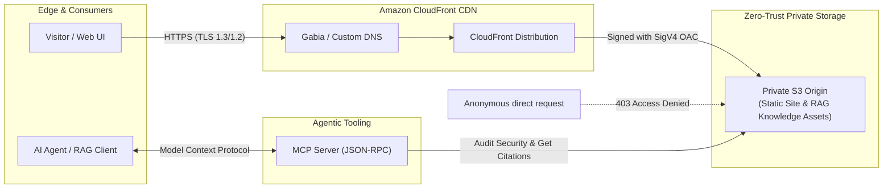

# Private S3 origin with CloudFront OAC

[](https://github.com/grapefruit0205/aws-private-s3-cloudfront-oac/actions/workflows/terraform.yml)

비공개 Amazon S3 버킷을 Amazon CloudFront의 Origin Access Control(OAC)에 연결하는 재현 가능한 Terraform 엔터프라이즈 레퍼런스 아키텍처입니다. 단순히 버킷을 비공개로 표시하는 데서 끝나지 않고, CloudFront가 SigV4로 서명한 요청 중 **이 배포에서 온 읽기 요청만** 버킷 정책이 허용하도록 구성합니다.

본 저장소는 **정적 웹 호스팅 보안 계약**을 넘어, 최신 **Enterprise Multimodal RAG(검색 증강 생성) 지식 스토리지** 및 **AI Agent 연동을 위한 Model Context Protocol(MCP) Server**를 함께 제공합니다.

---

## Architecture



S3 website endpoint는 사용하지 않습니다. CloudFront origin은 `bucket_regional_domain_name`으로 지정하며, 버킷의 Public Access Block 네 항목을 모두 활성화합니다.

---

## What this repository proves

- **Zero Trust S3 격리**: S3 ACL을 `BucketOwnerEnforced`로 비활성화하고, Public Access Block 네 항목을 모두 활성화합니다.
- **SigV4 OAC 보안 계약**: CloudFront OAC가 모든 origin 요청을 SigV4로 서명하며, 버킷 정책은 `cloudfront.amazonaws.com`의 `AWS:SourceArn` 일치 요청에만 `s3:GetObject`를 허용합니다.
- **Enterprise Multimodal RAG 연계**: 비공개 S3에 보관된 대용량 PDF 문서 및 파싱된 차트/도표를 CloudFront 엣지를 통해 안전하고 빠른 Citation 링크로 제공합니다. ([RAG Architecture 상세 가이드](docs/rag-architecture.md))
- **AI Agent (MCP) 연동**: Claude Desktop, Cursor 등 AI 에이전트가 인프라 보안을 감사하고 RAG 자산을 관리할 수 있는 [MCP Server](mcp-server/)를 포함합니다.
- **비용 없는 보안 계약 검증**: Terraform mock provider 기반 `terraform test`로 AWS 비용 없이 인프라 보안 계약을 자동 검증합니다.

---

## Repository layout

```text
.
├── .github/workflows/terraform.yml   # CI 파이프라인 (fmt, validate, terraform test)
├── demo-site/index.html              # 배포 경로 및 RAG/MCP 아키텍처 확인 페이지
├── docs/
│   ├── deployment-proof.md          # 실제 배포 증거 기록 템플릿
│   └── rag-architecture.md          # Enterprise Multimodal RAG 스토리지 설계 문서
├── mcp-server/                       # AI Agent 연동용 Model Context Protocol Server
│   ├── server.py                     # MCP Server 핵심 구현 (Python stdio JSON-RPC)
│   ├── requirements.txt              # 의존성 정의
│   ├── pyproject.toml                # 패키지 메타데이터
│   ├── README.md                     # Claude Desktop / Cursor 연동 가이드
│   └── tests/test_server.py          # MCP Server 단위 테스트
└── terraform/
    ├── main.tf                       # S3, OAC, CloudFront, bucket policy
    ├── variables.tf                  # 도메인과 인증서 등 입력값
    ├── outputs.tf                    # 배포 주소와 Gabia CNAME 값
    └── tests/security_contract.tftest.hcl
```

---

## Enterprise Multimodal RAG & MCP Features

### 1. Multimodal RAG Storage Architecture
* **문서 격리**: 민감 기업 사내 문서(PDF, Docx) 및 파싱된 고해상도 시각 자료(차트, 표 이미지)를 비공개 S3에 안전하게 보관.
* **엣지 캐싱 기반 Citation 전송**: AI 응답 시 LLM 컨텍스트 크기를 낭비하지 않고, CloudFront OAC를 거치는 고속 CDN URL을 클라이언트 UI에 전달.
* 자세한 설계는 [docs/rag-architecture.md](docs/rag-architecture.md)에서 확인하실 수 있습니다.

### 2. Model Context Protocol (MCP) Server
`mcp-server/` 디렉토리에 포함된 MCP 서버는 AI 에이전트(Claude Desktop, Cursor 등)에게 다음 도구를 제공합니다:

| 도구명 | 설명 |
| :--- | :--- |
| `verify_s3_oac_security` | S3 Public Access Block 및 OAC `AWS:SourceArn` 정책 준수 여부 자동 감사 |
| `get_rag_document_url` | RAG 인덱싱 자산의 안전한 CloudFront Citation URL 생성 |
| `list_rag_knowledge_assets` | S3 지식 베이스에 인덱싱된 자산 목록 조회 |
| `invalidate_cdn_cache` | 지식 문서 갱신 시 CloudFront 캐시 무효화 요청 |
| `get_infra_summary` | 현재 인프라 엔드포인트 및 보안 헤더 요약 정보 제공 |

---

## Test without creating AWS resources

### 1. Terraform Security Contract Test
Terraform 1.11 이상이 필요합니다. mock provider를 사용하여 실제 AWS 리소스를 생성하지 않고 보안 계약을 검증합니다.

```bash
cd terraform
terraform init -backend=false
terraform fmt -check -recursive
terraform validate
terraform test
```

성공 기준은 `5 passed, 0 failed`입니다.

### 2. MCP Server Test
Python 표준 라이브러리 `unittest`로 MCP 서버 도구 동작을 검증합니다.

```bash
cd mcp-server
python -m unittest discover tests
```

---

## Deploy

AWS 리소스에는 사용량에 따른 비용이 발생할 수 있습니다. 먼저 예제 변수를 복사하고 plan을 검토합니다.

```bash
cd terraform
cp terraform.tfvars.example terraform.tfvars
terraform init
terraform plan -out=tfplan
terraform apply tfplan
```

PowerShell에서는 복사 명령만 다음처럼 바꿉니다.

```powershell
Copy-Item terraform.tfvars.example terraform.tfvars
```

샘플 페이지 또는 정적 export 결과를 업로드한 뒤 CloudFront 캐시를 무효화합니다.

```bash
aws s3 sync ../demo-site "s3://$(terraform output -raw origin_bucket_name)" --delete
aws cloudfront create-invalidation \
  --distribution-id "$(terraform output -raw cloudfront_distribution_id)" \
  --paths "/*"
```

PowerShell에서는 다음 명령을 사용할 수 있습니다.

```powershell
$bucket = terraform output -raw origin_bucket_name
$distribution = terraform output -raw cloudfront_distribution_id
aws s3 sync ../demo-site "s3://$bucket" --delete
aws cloudfront create-invalidation --distribution-id $distribution --paths "/*"
```

---

## Connect a Gabia domain

1. ACM에서 인증서를 **미국 동부 버지니아 북부(`us-east-1`)** 리전에 요청합니다.
2. ACM이 제공하는 인증용 CNAME을 가비아 DNS 관리툴에 추가합니다.
3. 인증서 상태가 `ISSUED`가 된 뒤 `terraform.tfvars`에 `custom_domain`과 `acm_certificate_arn`을 함께 설정합니다.
4. 다시 `terraform apply`합니다.
5. `terraform output gabia_cname_record`가 출력한 CNAME을 가비아에 추가합니다.

```hcl
custom_domain       = "lab.example.com"
acm_certificate_arn = "arn:aws:acm:us-east-1:123456789012:certificate/replace-me"
```

가비아에 도메인을 등록해 둔 상태라도 등록기관을 옮길 필요는 없습니다. 서브도메인은 가비아 DNS의 CNAME으로 CloudFront에 연결할 수 있습니다.

---

## Verify the deployed security boundary

배포 후 [deployment proof checklist](docs/deployment-proof.md)에 결과를 기록합니다. 핵심 비교는 자격 증명 없는 S3 직접 요청의 `403`과 CloudFront 요청의 `200`입니다.

```bash
curl -I "https://BUCKET.s3.REGION.amazonaws.com/index.html"  # expected 403
curl -I "https://DISTRIBUTION.cloudfront.net/"               # expected 200
```

---

## Destroy safely

기본값 `force_destroy = false`는 객체가 든 버킷을 실수로 삭제하지 못하게 합니다. 실습 리소스를 제거하려면 먼저 버킷의 현재 객체와 버전을 정리한 뒤 `terraform destroy`를 실행합니다. CloudFront 삭제는 전 세계 엣지 반영 때문에 시간이 걸릴 수 있습니다.

---

## Primary references

- [AWS: Restrict access to an Amazon S3 origin](https://docs.aws.amazon.com/AmazonCloudFront/latest/DeveloperGuide/private-content-restricting-access-to-s3.html)
- [AWS: Requirements for CloudFront SSL/TLS certificates](https://docs.aws.amazon.com/AmazonCloudFront/latest/DeveloperGuide/cnames-and-https-requirements.html)
- [Anthropic: Model Context Protocol (MCP)](https://modelcontextprotocol.io/)
- [HashiCorp: Terraform tests](https://developer.hashicorp.com/terraform/language/tests)
- [Gabia: DNS record configuration](https://customer.gabia.com/manual/38/3041/3040)
