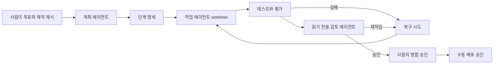

# AI 에이전트 사이트 하네스

개발 비전공자가 AI 코딩 에이전트를 어디까지 신뢰할 수 있는지 확인하기 위해 만든 실행·검증 저장소입니다. 결과물인 인터랙티브 칼럼과 AWS 인프라의 Git 이력을 보존하고, 이후 작업을 단계 명세, 격리된 worktree, 자동 검증, 읽기 전용 검토, 실패 복구로 운영합니다.

이 저장소의 포트폴리오 대상은 웹페이지 한 장이 아니라 그 웹페이지를 만들고 확인하는 작업 구조입니다.

## 이 저장소가 증명하는 것

| 주장 | 확인 가능한 증거 |
| --- | --- |
| 사이트를 단계적으로 구현하고 수정했다 | `frontend/`의 원본 커밋 `166b6b1`부터 `873ae0c`까지의 연결된 이력 |
| 실행 가능한 검증을 추가했다 | `e1fa9e1`, 현재 프론트엔드 테스트, 하네스 테스트 |
| 실패한 개편을 복구했다 | `26489b6`과 이를 되돌린 `40b571b` |
| 권한 경계를 설명하는 인터랙션을 구현했다 | `49f749b`와 `frontend/app/article-interactions.tsx` |
| 비공개 S3와 CloudFront OAC를 코드로 구성했다 | `infra/terraform/`, `140b6b0`, Terraform 보안 계약 |
| 실제 도메인 경로를 검증했다 | `infra/docs/deployment-proof.md`, `0321abc` |
| 하네스 도입 후 작업을 격리한다 | `phase/00-harness-bootstrap`, 단계 파일, worktree 테스트 |

`git log --graph --all`을 실행하면 프론트엔드와 인프라의 원본 커밋이 각각 harness import commit의 부모로 나타납니다. 파일만 복사한 저장소와 달리 어떤 변경이 언제 추가되고 되돌려졌는지 추적할 수 있습니다.

## 하네스 흐름



작업 에이전트는 `codex exec --json --sandbox workspace-write`로 실행한다. 검토 에이전트는 같은 비대화형 인터페이스를 `read-only` sandbox에서 사용한다. 두 역할 모두 단계 Markdown을 표준 입력으로 받으며 병합하거나 배포하지 않는다.

명령 형식은 공식 [Codex 비대화형 모드](https://learn.chatgpt.com/docs/non-interactive-mode)를 따른다. Worktree 격리는 [Codex worktree 안내](https://learn.chatgpt.com/docs/environments/git-worktrees)를 따르며, 저장소 규칙은 공식 [AGENTS.md 지침 계층](https://learn.chatgpt.com/docs/agent-configuration/agents-md)을 사용한다.

## 저장소 구성

```text
.
├─ .github/workflows/       결정적 CI와 프로덕션 수동 승인
├─ backend/                 실제 프로덕션 백엔드 사용 현황
├─ docs/
│  ├─ adr/                  설계 결정
│  ├─ architecture/         하네스와 AWS 경계
│  ├─ orchestration/        역할, 상태, 증거 규칙
│  ├─ phases/               실행 가능한 Markdown 작업 계약
│  └─ runbooks/             시작, 검증, 복구, 배포 절차
├─ frontend/                가져온 인터랙티브 칼럼과 이력
├─ infra/terraform/         가져온 CloudFront, OAC, 비공개 S3 코드
├─ skills/                  다른 프로젝트에서 재사용할 제작 지침
├─ tests/                   하네스 계약 및 통합 테스트
└─ tools/orchestration/     단계, worktree, Codex, 검증, 지표 도구
```

하네스를 검토할 때는 [문서 읽기 지도](docs/README.md)에서 시작한다. 비슷한 칼럼 사이트를 만들 때는 [인터랙티브 에디토리얼 사이트 Skill](skills/build-interactive-editorial-site/SKILL.md)과 [프론트엔드 작업 지침](frontend/AGENTS.md)을 함께 사용한다.

## 검증 실행

필요 도구:

- Node.js 22.13 이상
- Terraform 1.11 이상, CI는 1.15.8 사용
- Git
- 모델 실행을 시작할 때만 Codex CLI 필요

하네스 의존성을 설치하고 검증한다.

```powershell
npm ci
npm run verify:harness
```

가져온 프론트엔드를 검증한다.

```powershell
npm run verify:frontend
```

AWS 리소스를 만들지 않고 인프라를 검증한다.

```powershell
terraform -chdir=infra/terraform fmt -check -recursive
terraform -chdir=infra/terraform init -backend=false -input=false
terraform -chdir=infra/terraform validate
terraform -chdir=infra/terraform test
```

## 단계 실행

단계 계약을 검증하고 선언된 worktree를 만든다.

```powershell
npm run validate:phases
node tools/orchestration/new-phase.mjs docs/phases/phase-01-baseline-measurement.md
```

Codex를 시작하기 전에 명령과 프롬프트를 확인한다.

```powershell
node tools/orchestration/run-phase.mjs docs/phases/phase-01-baseline-measurement.md --dry-run
```

결정적 검증을 실행하고 원본 증거는 Git 밖에 보관한다.

```powershell
node tools/orchestration/verify-phase.mjs docs/phases/phase-01-baseline-measurement.md `
  --output .harness/runs/raw/phase-01-verification.json
```

검토, 복구, 배포 승인 절차는 `docs/runbooks/`에서 확인한다. 문서별 읽기 순서는 `docs/README.md`에 정리했다.

## 측정 지표

완료된 단계마다 다음 항목을 기록할 수 있다.

- 첫 시도 승인 여부
- 복구 시도 횟수
- 사람의 개입 횟수
- 최종 테스트 개수
- 단계 시작부터 승인까지 걸린 시간

Phase 01과 Phase 02에서는 단일 세션 작업과 하네스 작업을 제한된 범위에서 비교한다. 한 번의 비교는 사례 연구로만 다루며 일반적인 생산성 통계로 확대하지 않는다.

초기 구성 실행은 `docs/orchestration/runs/phase-00/`에 기록했다. 저장소 경로 오류를 한 번 복구한 뒤 하네스, 프론트엔드, Terraform 계약 검증 35개를 통과했다.

## 배포 경계

프로덕션 요청 경로:

```text
브라우저 → CloudFront → OAC 서명 요청 → 비공개 S3 원본
```

Pull Request 워크플로는 배포하지 않는다. `deploy-manual.yml`은 수동 boolean 입력과 GitHub OIDC로 발급한 단기 AWS 자격 증명을 요구한다. `production` 환경을 참조하지만 초기 구성에서는 보호 규칙을 설정하지 않았다. 프로덕션 배포를 활성화하기 전에 필수 검토자를 추가해야 한다. 워크플로는 정적 파일을 업로드하기 전에 빌드와 테스트를 실행하며 `terraform apply`는 실행하지 않는다.

## 한계

- 가져온 Git 데이터에서 원본 프론트엔드 저장소의 `main`만 확인할 수 있다. 과거 worktree나 서브에이전트 사용 여부는 증명할 수 없으므로 소급해 주장하지 않는다.
- 사이트에는 프로덕션 애플리케이션 백엔드가 없다. `frontend/`의 Worker, D1, Drizzle 파일은 가져온 초기 구성이고 배포된 백엔드의 증거가 아니다.
- Codex 원본 JSONL에는 비공개 문맥이 들어갈 수 있으므로 Git에서 제외한다. 민감정보를 제거한 결정과 지표만 커밋한다.
- 가져올 당시 프론트엔드 원본 저장소는 비공개였다. 전체 이력의 비밀정보와 공개 적합성을 검토할 때까지 이 저장소를 비공개로 유지한다.
- 초기 구성 환경에서는 Windows의 프로세스 접근 거부로 데스크톱 앱에 포함된 `codex.exe`를 셸에서 실행하지 못했다. 명령 생성기와 dry-run 경로는 테스트했지만 실제 Codex 실행에는 셸에서 접근 가능한 CLI 설치와 인증이 필요하다.

주장과 커밋의 연결은 `docs/phases/history-map.md`에 기록했다.
