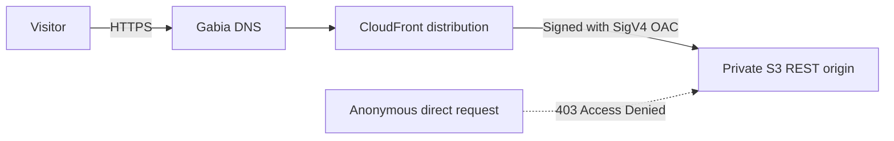

# Private S3 origin with CloudFront OAC

[](https://github.com/grapefruit0205/aws-private-s3-cloudfront-oac/actions/workflows/terraform.yml)

비공개 Amazon S3 버킷을 Amazon CloudFront의 Origin Access Control(OAC)에 연결하는 재현 가능한 Terraform 예제입니다. 단순히 버킷을 비공개로 표시하는 데서 끝나지 않고, CloudFront가 SigV4로 서명한 요청 중 **이 배포에서 온 읽기 요청만** 버킷 정책이 허용하도록 구성합니다.

## Architecture



S3 website endpoint는 사용하지 않습니다. CloudFront origin은 `bucket_regional_domain_name`으로 지정하며, 버킷의 Public Access Block 네 항목을 모두 활성화합니다.

## What this repository proves

- S3 ACL을 `BucketOwnerEnforced`로 비활성화합니다.
- S3 Public Access Block 네 항목을 모두 활성화합니다.
- CloudFront OAC가 모든 origin 요청을 SigV4로 서명합니다.
- 버킷 정책은 `cloudfront.amazonaws.com`에 `s3:GetObject`만 허용합니다.
- `AWS:SourceArn` 조건이 접근 권한을 한 CloudFront distribution으로 제한합니다.
- 방문자는 HTTP에서 HTTPS로 리디렉션됩니다.
- Terraform mock provider 테스트가 AWS 비용 없이 위 보안 계약을 검사합니다.

## Repository layout

```text
.
├── .github/workflows/terraform.yml   # fmt, validate, terraform test
├── demo-site/index.html              # 배포 경로를 확인하는 최소 페이지
├── docs/deployment-proof.md          # 실제 배포 증거 기록 템플릿
└── terraform/
    ├── main.tf                       # S3, OAC, CloudFront, bucket policy
    ├── variables.tf                  # 도메인과 인증서 등 입력값
    ├── outputs.tf                    # 배포 주소와 Gabia CNAME 값
    └── tests/security_contract.tftest.hcl
```

## Test without creating AWS resources

Terraform 1.11 이상이 필요합니다. 테스트는 mock provider와 `command = plan`을 사용하므로 AWS 자격 증명이나 실제 리소스를 만들지 않습니다.

```bash
cd terraform
terraform init -backend=false
terraform fmt -check -recursive
terraform validate
terraform test
```

성공 기준은 `5 passed, 0 failed`입니다.

## Deploy

AWS 리소스에는 사용량에 따른 비용이 발생할 수 있습니다. 먼저 예제 변수를 복사하고 plan을 검토합니다.

```bash
cd terraform
cp terraform.tfvars.example terraform.tfvars
terraform init
terraform plan -out=tfplan
terraform apply tfplan
```

PowerShell에서는 복사 명령만 다음처럼 바꿉니다.

```powershell
Copy-Item terraform.tfvars.example terraform.tfvars
```

샘플 페이지 또는 정적 export 결과를 업로드한 뒤 CloudFront 캐시를 무효화합니다.

```bash
aws s3 sync ../demo-site "s3://$(terraform output -raw origin_bucket_name)" --delete
aws cloudfront create-invalidation \
  --distribution-id "$(terraform output -raw cloudfront_distribution_id)" \
  --paths "/*"
```

PowerShell에서는 다음 명령을 사용할 수 있습니다.

```powershell
$bucket = terraform output -raw origin_bucket_name
$distribution = terraform output -raw cloudfront_distribution_id
aws s3 sync ../demo-site "s3://$bucket" --delete
aws cloudfront create-invalidation --distribution-id $distribution --paths "/*"
```

## Connect a Gabia domain

1. ACM에서 인증서를 **미국 동부 버지니아 북부(`us-east-1`)** 리전에 요청합니다.
2. ACM이 제공하는 인증용 CNAME을 가비아 DNS 관리툴에 추가합니다.
3. 인증서 상태가 `ISSUED`가 된 뒤 `terraform.tfvars`에 `custom_domain`과 `acm_certificate_arn`을 함께 설정합니다.
4. 다시 `terraform apply`합니다.
5. `terraform output gabia_cname_record`가 출력한 CNAME을 가비아에 추가합니다.

```hcl
custom_domain       = "lab.example.com"
acm_certificate_arn = "arn:aws:acm:us-east-1:123456789012:certificate/replace-me"
```

가비아에 도메인을 등록해 둔 상태라도 등록기관을 옮길 필요는 없습니다. 서브도메인은 가비아 DNS의 CNAME으로 CloudFront에 연결할 수 있습니다.

## Verify the deployed security boundary

배포 후 [deployment proof checklist](docs/deployment-proof.md)에 결과를 기록합니다. 핵심 비교는 자격 증명 없는 S3 직접 요청의 `403`과 CloudFront 요청의 `200`입니다.

```bash
curl -I "https://BUCKET.s3.REGION.amazonaws.com/index.html"  # expected 403
curl -I "https://DISTRIBUTION.cloudfront.net/"               # expected 200
```

## Destroy safely

기본값 `force_destroy = false`는 객체가 든 버킷을 실수로 삭제하지 못하게 합니다. 실습 리소스를 제거하려면 먼저 버킷의 현재 객체와 버전을 정리한 뒤 `terraform destroy`를 실행합니다. CloudFront 삭제는 전 세계 엣지 반영 때문에 시간이 걸릴 수 있습니다.

## Primary references

- [AWS: Restrict access to an Amazon S3 origin](https://docs.aws.amazon.com/AmazonCloudFront/latest/DeveloperGuide/private-content-restricting-access-to-s3.html)
- [AWS: Requirements for CloudFront SSL/TLS certificates](https://docs.aws.amazon.com/AmazonCloudFront/latest/DeveloperGuide/cnames-and-https-requirements.html)
- [HashiCorp: Terraform tests](https://developer.hashicorp.com/terraform/language/tests)
- [Gabia: DNS record configuration](https://customer.gabia.com/manual/38/3041/3040)
