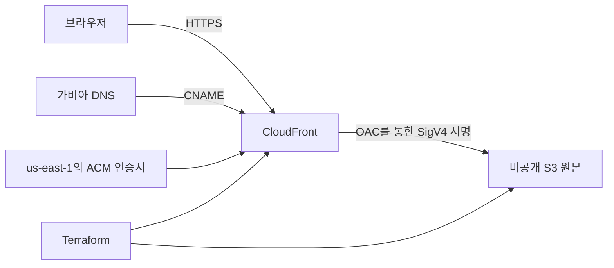

# 배포 아키텍처

S3 버킷은 퍼블릭 액세스를 차단한다. 버킷 정책은 요청 출처가 지정한 배포 ARN과 일치할 때만 CloudFront 서비스에 `s3:GetObject`를 허용한다. Terraform 계약 테스트는 모의 AWS provider를 사용하므로 CI에서 실제 리소스를 만들지 않고도 이 경계를 검증한다.

`deploy-manual.yml`은 수동 요청이 들어올 때마다 빌드한다. `perform_deploy` 값이 true이고 저장소에 필요한 AWS OIDC 변수가 있을 때만 파일을 업로드한다. 작업은 `production` 환경을 참조하지만 필수 검토자 보호 규칙은 관리자가 별도로 설정해야 한다.
