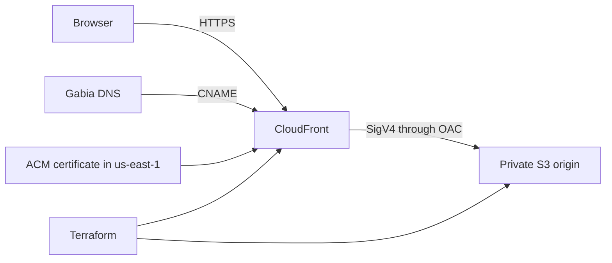

# Deployment architecture

The S3 bucket blocks public access. Its policy grants `s3:GetObject` to the CloudFront service only when the request source matches the expected distribution ARN. The Terraform contract tests use a mocked AWS provider, so CI can verify this boundary without provisioning resources.

`deploy-manual.yml` builds on every manual request. It uploads files only when `perform_deploy` is true, the `production` environment approves the job, and the repository has the required AWS OIDC variables.
