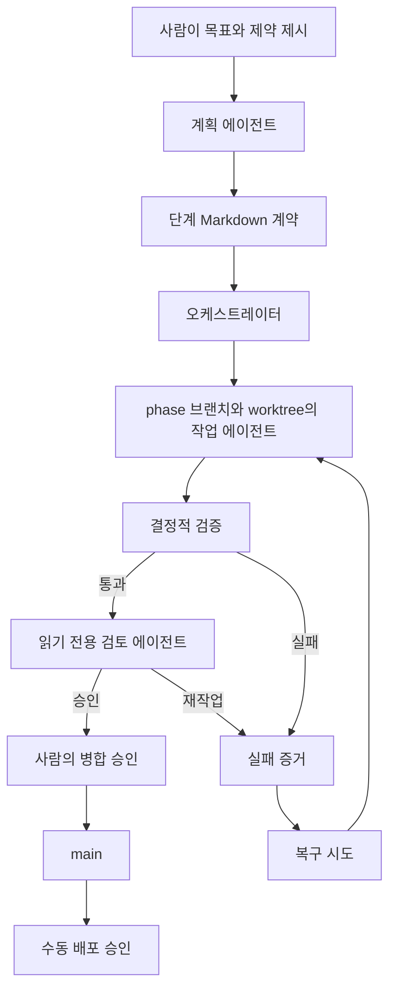

# 하네스 아키텍처

## 신뢰 경계

단계 문서는 작업 범위를 제한하고 완료 여부를 판단할 명령을 선언한다. 작업 에이전트에는 `workspace-write`, 검토 에이전트에는 `read-only` 권한을 부여한다. 두 역할 모두 병합하거나 배포하지 않는다. GitHub Actions는 깨끗한 실행 환경에서 결정적 검증을 반복한다. 프로덕션 워크플로는 수동 입력을 요구하고 `production` 환경을 참조한다. 저장소 관리자가 필수 검토자를 설정하기 전에는 이 환경을 승인 경계로 간주하지 않는다.

## 증거가 남는 경로

1. Git은 원본 커밋, 단계 브랜치, 구현 diff, 검토 결정, 병합을 기록한다.
2. 검증 JSON은 실행한 명령과 종료 코드를 기록한다.
3. 실행 요약은 첫 시도 결과, 복구 횟수, 사람의 개입, 최종 테스트 결과를 기록한다.
4. 배포 증거는 자격 증명과 상태 파일을 커밋하지 않고 CloudFront와 비공개 원본의 동작을 기록한다.
