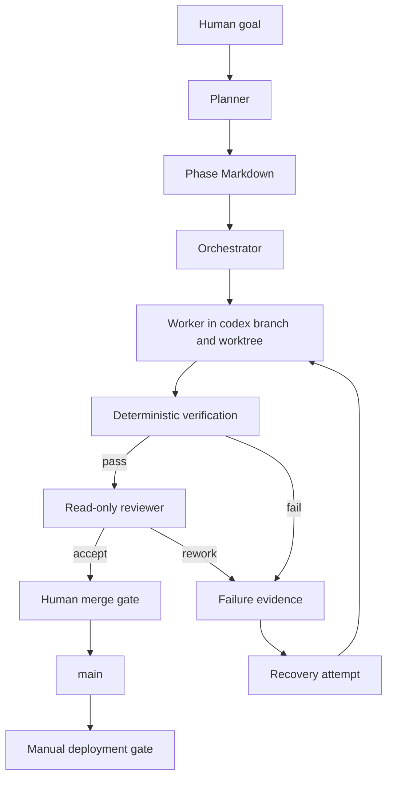

# Harness architecture

## Trust boundaries

The phase file limits scope and declares the commands that decide completion. The worker receives `workspace-write`; the reviewer receives `read-only`. Neither role merges or deploys. GitHub Actions repeats deterministic checks in a clean runner. The production workflow requires a manual input and references a `production` environment. Repository administrators must configure that environment's required reviewers before treating it as an approval boundary.

## Evidence path

1. Git records the source commit, phase branch, implementation diff, review decision, and merge.
2. Verification JSON records every command and exit code.
3. A run summary records first-pass status, recovery count, human interventions, and final tests.
4. Deployment proof records CloudFront and private-origin behavior without committing credentials or state.
