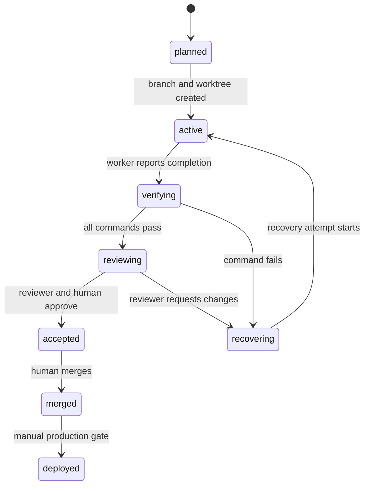

# Phase state machine

## Rules

- A failed verification remains in the run history.
- A reviewer cannot edit the worker worktree.
- An accepted phase can still remain undeployed.
- Deployment requires a separate approval because it changes AWS state and can incur cost.
- A phase that lacks acceptance criteria or a `phase/` branch fails contract validation.
