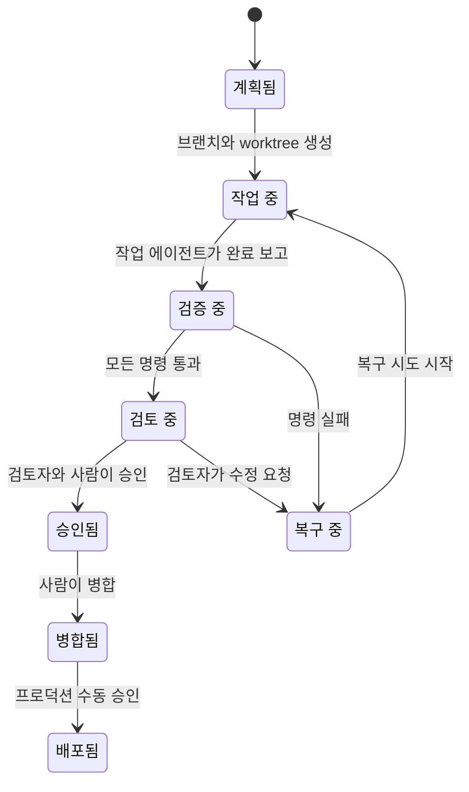

# 단계 상태 머신

## 규칙

- 실패한 검증은 실행 이력에 남긴다.
- 검토 에이전트는 작업 worktree를 수정할 수 없다.
- 승인된 단계라도 배포하지 않은 상태로 둘 수 있다.
- 배포는 AWS 상태를 바꾸고 비용을 발생시킬 수 있으므로 별도 승인을 요구한다.
- 인수 조건이나 `phase/` 브랜치가 없는 단계는 계약 검증에서 실패한다.
