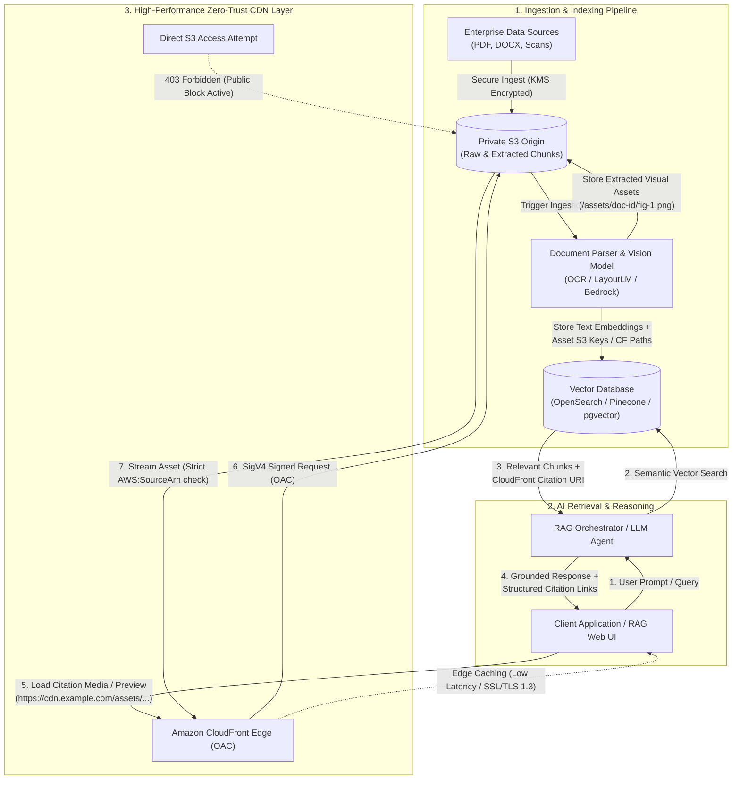

# Enterprise Multimodal RAG with AWS S3 & CloudFront OAC

This document details how the **Private S3 + CloudFront Origin Access Control (OAC)** baseline serves as a high-security, low-latency foundation for **Enterprise Multimodal RAG (Retrieval-Augmented Generation)** systems.

---

## 1. The Challenge in Enterprise RAG Systems

Modern Enterprise RAG architectures do not merely process plain text snippets. They handle complex, confidential enterprise assets:
- **Multimodal Documents**: High-resolution PDF pages, financial reports, technical architecture blueprints, medical scans, and schematics.
- **Strict Data Governance**: Raw documents must never be publicly accessible over the internet or exposed via unrestricted S3 buckets.
- **Latency & Bandwidth Costs**: Passing entire binary documents or high-res images through LLM prompts is slow, costly, and context-window limited.
- **Secure Visual Citations**: When the AI answers user queries, it must provide verifiable citations (e.g., viewing Page 14's table or diagram) to the client UI securely and with edge-cached performance.

---

## 2. End-to-End Multimodal RAG Architecture



---

## 3. Key Architectural Benefits

### A. Zero-Trust S3 Isolation
- S3 Public Access Block is 100% active (`block_public_acls = true`, `block_public_policy = true`, etc.).
- Direct HTTP/HTTPS requests to the S3 bucket URL return `403 Forbidden`.
- The bucket policy only permits the `cloudfront.amazonaws.com` service principal matching the specific `AWS:SourceArn` of the CloudFront distribution.

### B. High-Performance Visual Citations & Chunk Streaming
- Vector search returns semantic text along with reference asset keys (e.g. `assets/2026-q2-report/table-3.png`).
- Client web applications stream image citations directly from the global CloudFront Edge without burdening the RAG backend API.
- CloudFront response headers enforce security best practices (`X-Frame-Options`, `Content-Security-Policy`, HSTS, `X-Content-Type-Options: nosniff`).

### C. Scalable Storage Tiering & Lifecycle
- **Active RAG Assets**: Cached at CloudFront PoPs with standard S3 tiering.
- **Historical / Raw Archives**: S3 Intelligent-Tiering and Lifecycle configurations transition cold source documents to Glacier without breaking OAC access paths.

---

## 4. RAG Asset Citation Schema Example

When a RAG retrieval system queries the vector store, it pairs textual knowledge chunks with secure CDN URLs:

```json
{
  "query": "What were the Q2 cloud infrastructure cost drivers?",
  "answer": "The primary cost driver in Q2 was the expansion of multi-region vector storage (14.2% increase), as illustrated in Figure 4.",
  "citations": [
    {
      "source_document": "2026-q2-financial-report.pdf",
      "page": 14,
      "chunk_id": "chunk_q2_infra_9812",
      "media_type": "image/webp",
      "citation_url": "https://cdn.example.com/assets/2026-q2/figure-4-cost-breakdown.webp",
      "cdn_status": "Cached at CloudFront Edge (SigV4 OAC Verified)"
    }
  ]
}
```

---

## 5. Security & Threat Mitigation Matrix

| Threat / Risk | Mitigating Architecture Control |
| :--- | :--- |
| **Unauthenticated S3 Data Scraping** | S3 Public Access Block + Strict OAC SigV4 condition (`AWS:SourceArn`). |
| **Data in Transit Eavesdropping** | HTTPS enforcement (`redirect-to-https`, TLSv1.2_2021 / TLSv1.3), `aws:SecureTransport: true` Deny policy. |
| **Origin Overload during AI Spikes** | CloudFront Edge caching for frequent visual citations (Default TTL: 3600s). |
| **Clickjacking / MIME sniffing on Docs** | CloudFront Response Headers Policy (`X-Frame-Options: DENY`, `nosniff`). |
